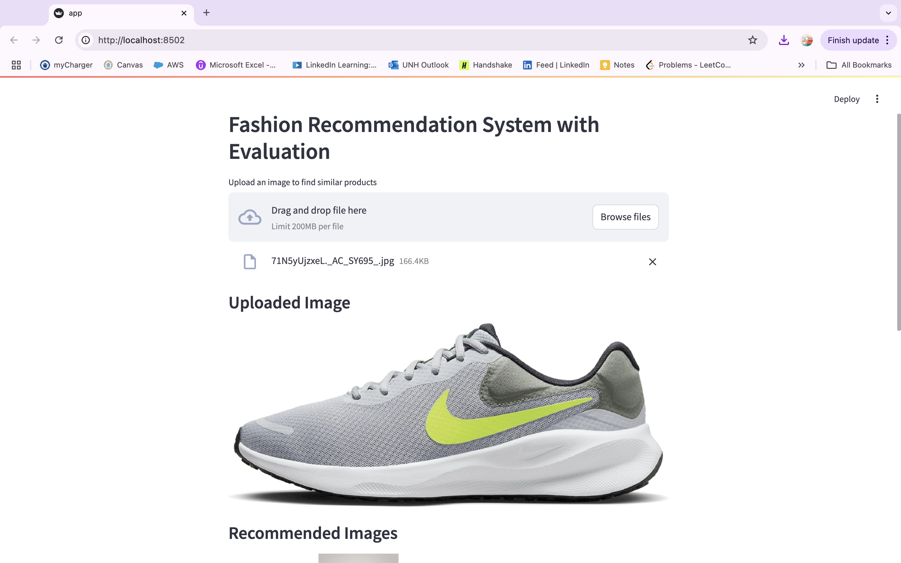
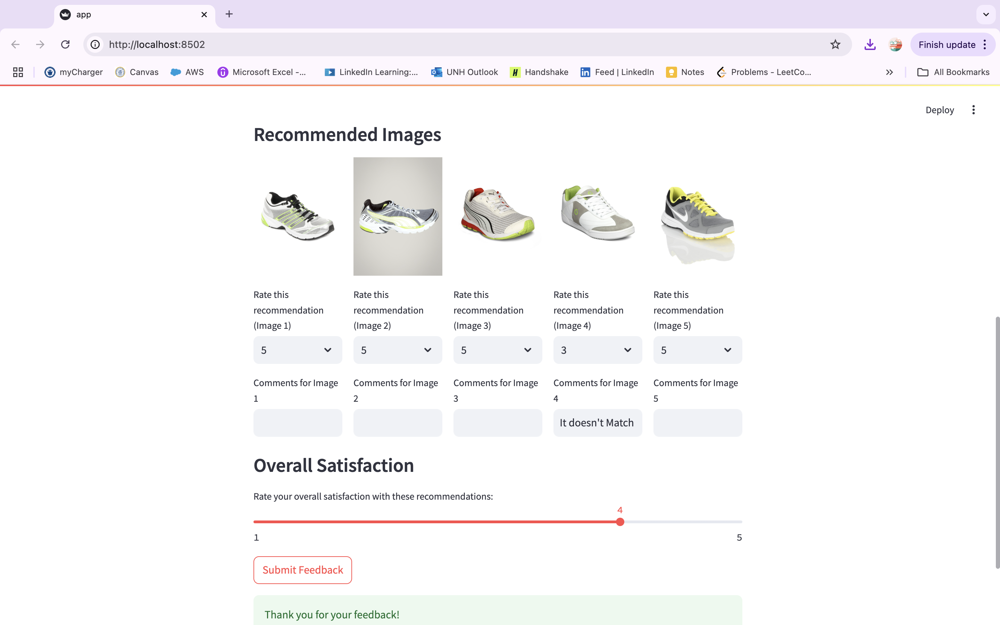

# Fashion Recommendation System

## 📌 Project Overview
The **Fashion Recommendation System** is designed to enhance the online shopping experience by providing personalized product recommendations. Using deep learning and content-based filtering, the system suggests fashion items tailored to individual user preferences.

## 🎯 Objectives
- Build a **Fashion Item Classification Model** using **CNN**.
- Develop a **Recommendation Engine** for personalized shopping experiences.
- Leverage **feature embeddings** for improved recommendation accuracy.
- Deploy the solution via **Streamlit** for real-time user interaction.

## 📂 Dataset
- **Dataset Link:** [Fashion Product Images Dataset](https://www.kaggle.com/datasets/paramaggarwal/fashion-product-images-dataset)
- **Dataset Name:** Fashion Product Images
- **Size:** 44.4k high-resolution images
- **Categories:** Shirts, dresses, shoes, jackets, accessories, etc.
- **Features:** Labeled images, descriptive product attributes, multi-label classification.

## 🛠️ Tech Stack
- **Programming Language:** Python
- **Deep Learning Frameworks:** TensorFlow/Keras
- **Model Architectures:** ResNet50, EfficientNetB7
- **Libraries:** OpenCV, NumPy, Pandas, Matplotlib, Scikit-learn
- **Recommendation Algorithm:** Nearest Neighbors
- **Deployment:** Streamlit

## 🏗️ Methodology
1. **Data Preparation**
   - Data augmentation for better model generalization.
   - Preprocessing of images and labels.

2. **Model Development**
   - Trained **ResNet50** and **EfficientNetB7** with transfer learning.
   - Extracted feature embeddings for recommendations.

3. **Recommendation System**
   - Implemented a **content-based filtering** approach.
   - Used **Nearest Neighbors** to find similar fashion items.

4. **Deployment**
   - Built a user-friendly **Streamlit app** for real-time recommendations.
   - Enabled users to input preferences and receive personalized fashion suggestions.

## 📊 Results
- **ResNet50** achieved higher accuracy and was chosen for feature extraction.
- **EfficientNetB7** offered computational efficiency but lower accuracy.
- The **recommendation engine** provided relevant and diverse product suggestions.

    

    

## 👨‍💻 Contributors
- **Vedanth Reddy Doddannagari**
- **Shashank Madipelly**
- **Manichandra Domala**
- **Sai Gowtham Reddy Gurrala**

⭐ **If you like this project, give it a star on GitHub!** ⭐
